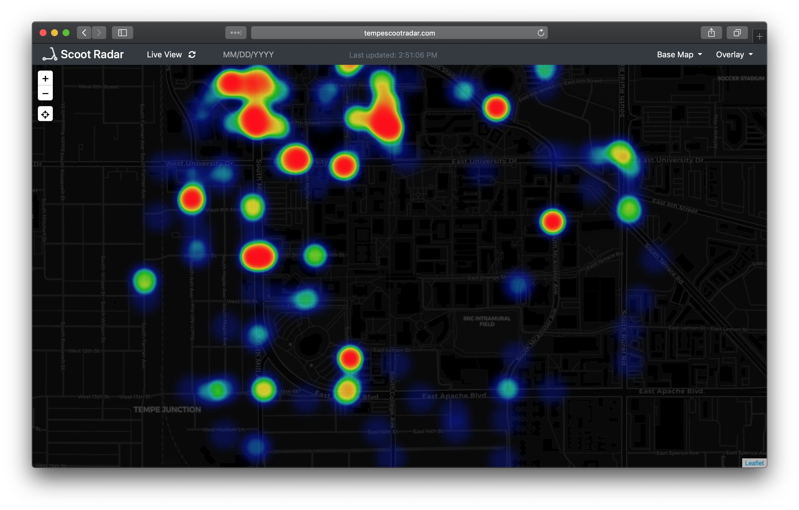
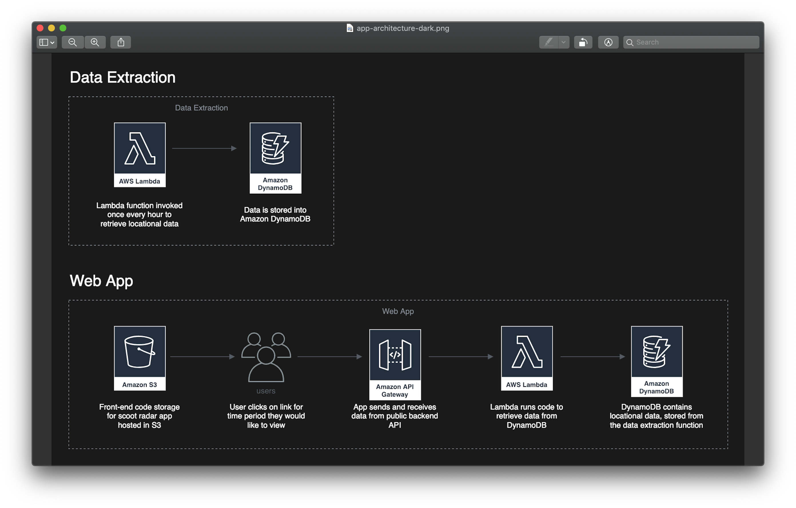

<!-- markdownlint-disable MD034 -->

# Scoot Radar #

Data visualization tool for E-Scooters around ASU  

Serverless and cloud based, optimized for use with AWS services. Core application logic relies on serverless compute functionality with AWS Lambda https://aws.amazon.com/lambda/. Application data storage utilizes Amazon's non relational database service DynamoDB https://aws.amazon.com/dynamodb/. Web app front end files statically hosted via Amazon S3 https://aws.amazon.com/s3/. Communication between app front and serverless back end made possible via Amazon API Gateway https://aws.amazon.com/api-gateway/. Application monitoring and error tracing made possible through Amazon CloudWatch https://aws.amazon.com/cloudwatch/.

Inspiration  

http://conormclaughlin.net/2018/08/tracking-the-flow-of-bird-scooters-across-dc/